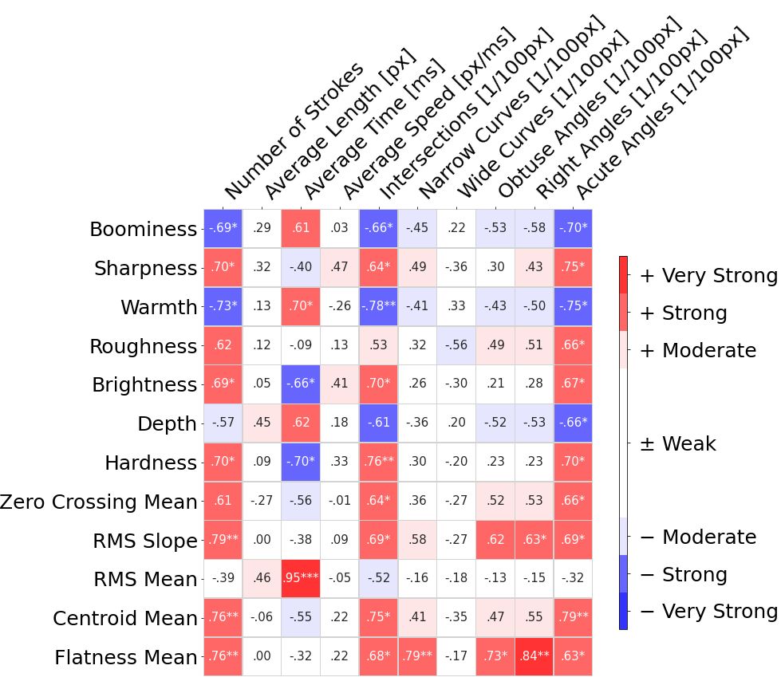
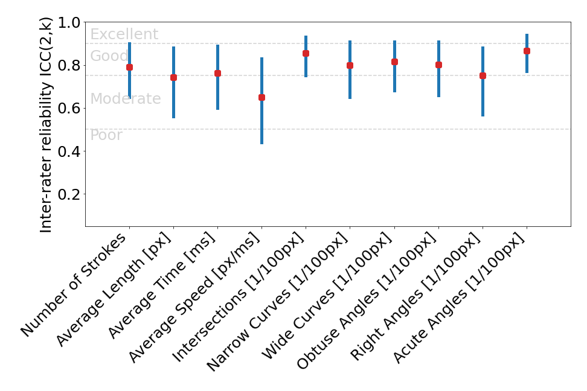
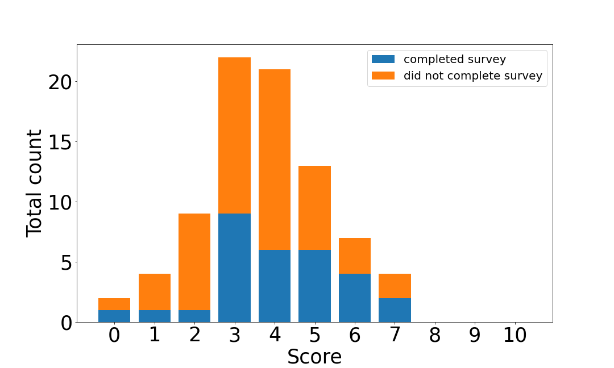
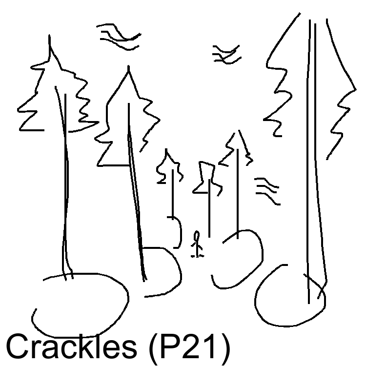
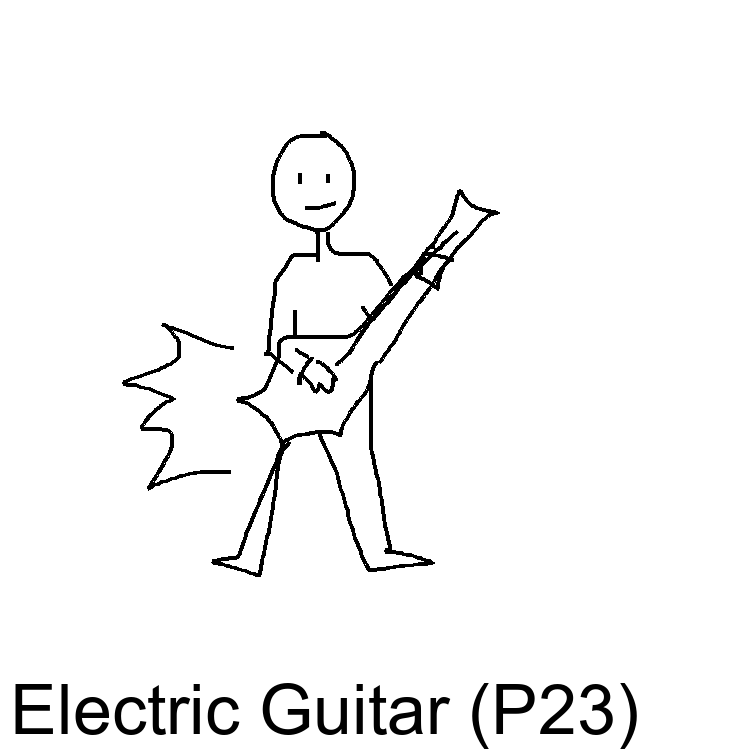
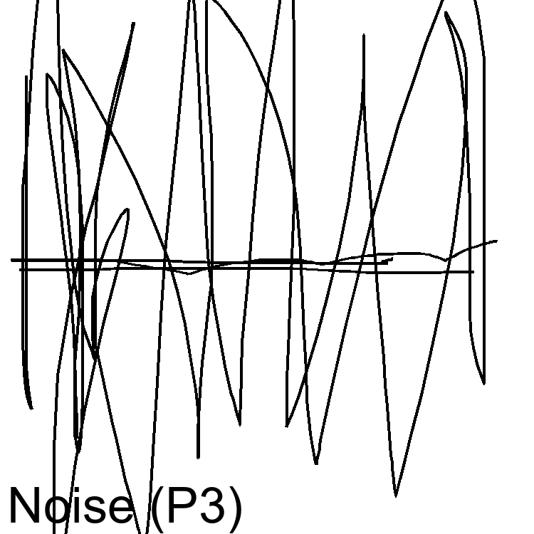
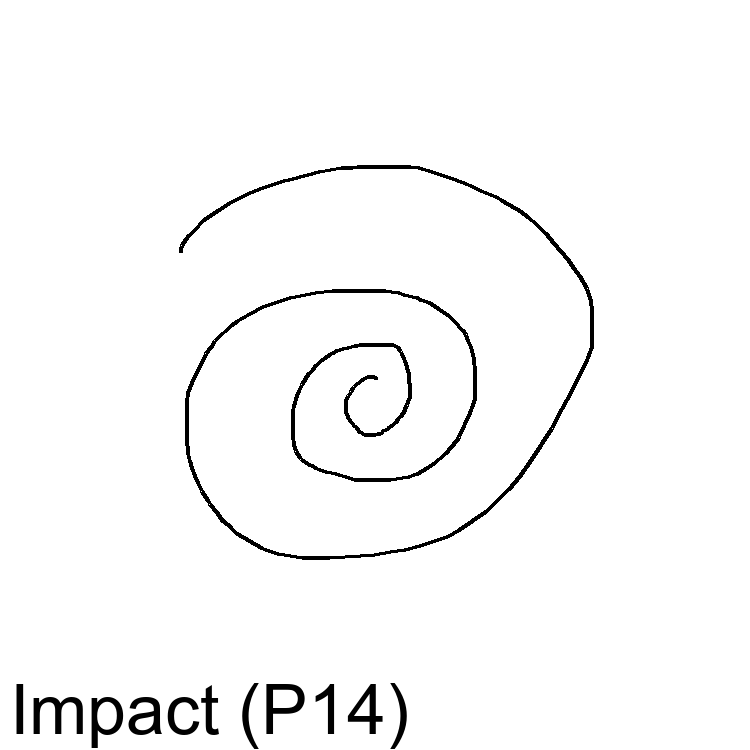
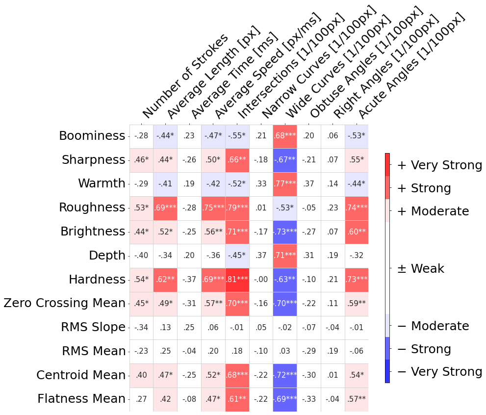
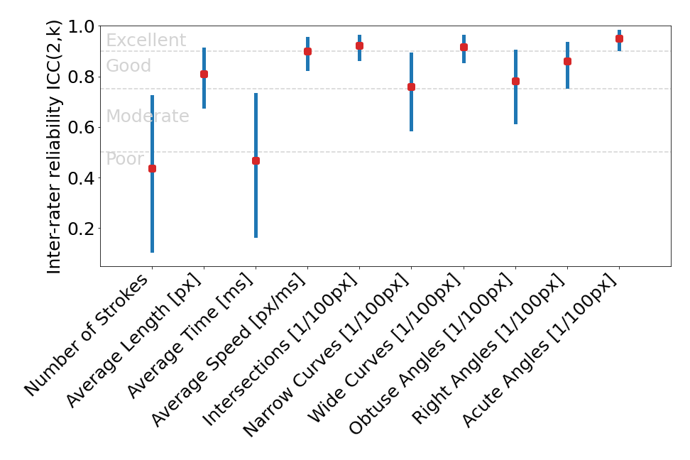
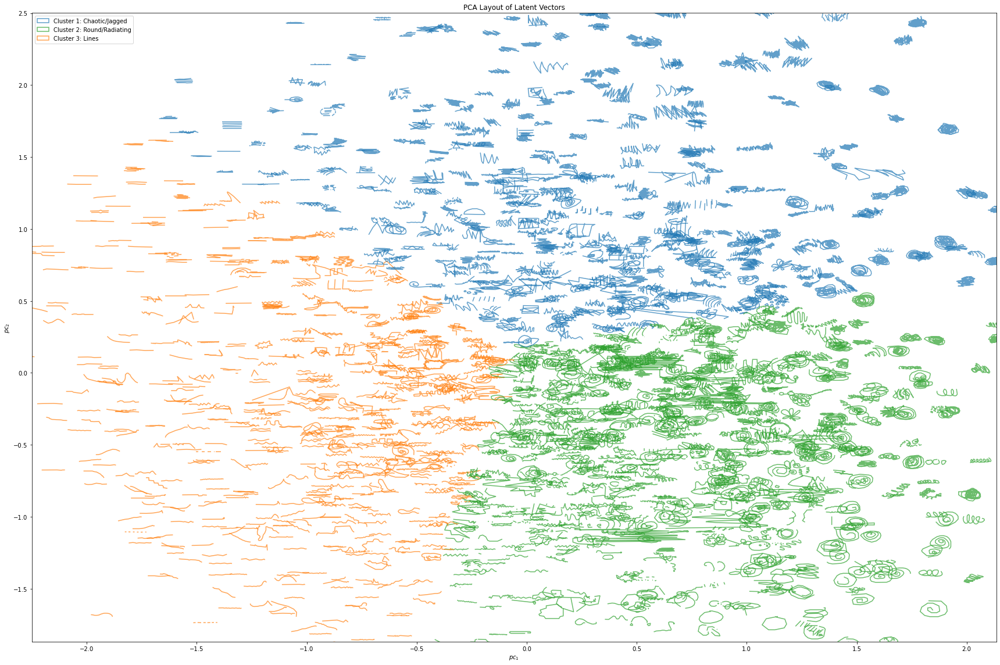

# Sketching Sounds: Using sound-shape associations to build a sketch-based sound synthesiser 

This is the repository related to my PhD research at the Centre for Digital Music at Queen Mary University of London.

## Abstract
Humans are surprisingly good at creating mental images of sound, however current tools rarely accommodate a perception-centered production approach that allows for a straightforward realisation of sound ideas. While research has found commonalities in how humans describe sound across various modalities, this research focuses on the cross-modal associations between sound and visual shapes and how they can be used to drive sound synthesis. The results will be used to build a functioning sketch-based sound synthesiser. Based in the field of music psychology and music computing, this research also touches on the fields of interaction design, human-computer interaction and musical interfaces.

For a quick overview, please have a look at this [website](https://sfrl.github.io/PhD_Research_Sketching_Sounds/Webpage/).

# Stage 1
## Study 1.1 - Sketching Sounds: An exploratory study on sound-shape associations 

### Introduction
This study aims to discover how participants represent different sounds visually using a simple digital drawing interface. 28 participants (14 female) were presented with 10 different sounds and were asked to draw whatever they believe represented the sound best. Sounds were chosen to represent different timbral characteristics (brightness, noisiness, warmth etc.) and sources (synthesisers, acoustic instruments and abstract textures). Each of the 10 sounds was repeated during a study run, leading to a total of 20 sketches per participant. Sketches were categorised by 6 participants (4 female) in a card sorting study.  

### Results
The results show that the participants' sketches show some commonalities. While some participants use figurative images (e.g. a piano or a cello) to describe a sound, most chose abstract representations. Quantitative features like corner or curve points were extracted from these abstract sketches to find possible correlations with audio features. The results showed correlations that align with existing body of sound-shape research. In addition, inter-rater reliability analysis using the two-way random, average score interclass coefficient model (ICC(2,k)) suggests some agreement exists between participants on how to represent sounds visually. 

|

|

|:--:|:--:|
Spearman’s rank correlation coefficients between sketch and audio features with annotated p-values: p<.05 (\*), .01 (\*\*), .001 (\*\*\*)|Mean values and 95% confidence intervals of ICC(2,k) inter-rater reliabilities for each sketch feature with evaluation guidelines|

### Material

The study can be accessed [here](https://sfrl.github.io/PhD_Research_Sketching_Sounds/Stage_1/Study1_part1/Study_setup/) and the code is available under [./Stage_1/Study1_part1/Study_setup/](./Stage_1/Study1_part1/Study_setup/).

The Jupyter notebook containing the analysis of the card sorting analysis can be found [here](https://github.com/SFRL/PhD_Research_Sketching_Sounds/blob/master/Stage_1/Study1_part1/Card_Sorting_Analysis.ipynb)

The Jupyter notebook containing the data analysis including more graphs can be found [here](https://github.com/SFRL/PhD_Research_Sketching_Sounds/blob/master/Stage_1/Study1_part1/Sketching_Sounds_an_exploratory_study_analysis.ipynb).

The sketches have been compiled into an interactive gallery, including the sounds, that can be explored [here](https://sfrl.github.io/PhD_Research_Sketching_Sounds/Stage_1/Study1_part1/Sketch_Gallery/).

The sound-sketch dataset including audio files can be accessed in the [Datasets](./Datasets) folder.

The results have been compiled into a [conference paper](https://sebastianlobbers.com/static/bfe467bb4c543d6030067096eca99f27/ICMC_Paper_2021.pdf) that was presented at the International Computer Music Conference (ICMC) in 2021. 

## Study 1.2 - Seeing Sounds, Hearing Shapes: a gamified study to evaluate sound-sketches

### Introduction
This study took abstract sketches from study 1.1 and presents them to participants in a quiz-like gamified survey. Participants heard a sound and had to find the matching sketch from 4 different options. The aim of this study is to find out if intuitive sound-sketches can communicate sound characteristics. The study was presented at the Ars Electronica Festival 2020 and the Edinburgh Science Festival 2021 and 82 participants took part of which 30 (13 female, 16 male, 1 unknown) completed an optional post-study survey. 

### Results
Participants on average scored significantly higher than the random baseline of 2.5, but, with a mean of 3.74, the average score was lower than in comparable studies that used visual representations that were designed to maximise recognition (see for example Grill and Flexer *Visualization of perceptual qualities in textural sounds*). However, it still shows that even simple, intuitive sketches can communicate sound to other people to some extent. Further analysis revealed differences in scores between sounds with the correct match found most commonly for *Piano* and *Noise*. This suggests that the perceptual dimension for noisiness and calmness was encoded especially well in the sketches.      

|

|
|:---:|
|Distribution of scores by participants of the Seeing Sounds, Hearing Shapes game. The **mean score is 3.74** for all participants, 4.07 for participants who completed the survey and 3.56 for participants who did not complete the survey.|

### Material
The study can be accessed [here](https://phd-studies-eddd5.web.app/) and the code is available under [./Stage_1/Study1_part2/Study_setup](./Stage_1/Study1_part2/Study_setup).

The study is part of the online exhibitions [The Garden of Forking Paths](https://forkingpaths.intersections.io/) and [Seeing Music](https://www.seeingmusic.app/).

The results have been compiled into a paper for the International Computer Music Conference (ICMC) 2022 and is currently under review.

# Stage 2

## Interface Design 

Study 1.1 produced a large variety in different sketches making it difficult to find a "fit-for-all" analysis method. This becomes particularly evident with figurative and abstract sketches. Figurative sketches commonly display real-life associations with a sound like a musical instrument or a scene while abstract sketches tend to be connected closer to the characteristics of a sound (e.g. how noisy, bright or deep a sound is). The former asks for an architecture that recognises the objects contained in a sketch (e.g. an electric guitar) while the latter need to extracts features that describe the shape of a sketch. 

As this research focuses on sound-shape associations, the aim of the interface design was to find **a configuration that encourages abstract representations** while still allowing users to be expressive. This was achieved through a series of three prototype evaluation studies. 

|

|

|
|:--:|:--:|

Examples of **figurative sketches** 

|

|

|
|:--:|:--:|

Examples of **abstract sketches** 

Based on feedback from Study 1.1 to improve the sketching "smoothness", for all following prototypes the stroke width was increased from 2 to 6 pixels, Catmull-Rom splines were used to connect sketch points (using the p5.js function [*curveVertex()*](https://p5js.org/reference/#/p5/curveVertex)) and the Ramer–Douglas–Peucker (RDP) algorithm was used for stroke simplification. The design closely follows the [*Quick, Draw!* game](https://quickdraw.withgoogle.com/). 

### Prototype 1
Within-subject A/B testing was used to investigate if the timing of the RDP simplification has an influence on the representational style. The hypothesis was that applying RDP during sketching will make it harder to sketch detail and encourage abstract representations compared to when applying it after a stroke is completed. However, the results didn't show any difference between the two options and participants still produced a fair amount of abstract sketches.

Click [here](https://sfrl.github.io/PhD_interface_design/interface_1/) to try this prototype.

### Prototype 2
This iteration used a highly restrictive design with sketch length limited to 150 points and one stroke. When a participant started a new stroke the previous stroke was deleted. This setup resulted in exclusively abstract sketches, but participants rated it low for expressivity. 

Click [here](https://sfrl.github.io/PhD_interface_design/interface_2/) to try this prototype.

### Prototype 3
For the final prototype, the 150 point limit was kept in place without limiting the number of strokes. When a participant reached the limit the beginning of the sketch started getting deleted when continue drawing. This setup resulted in almost exclusively abstract sketches and participants rated it higher for expressivity.

Click [here](https://sfrl.github.io/PhD_interface_design/interface_3/) to try this prototype.

### Material

A GitHub [repository](https://github.com/SFRL/PhD_interface_design) is available with the code for all prototypes.

The results are currently compiled into a journal paper and will be available soon.

## Study 2.1: Creating a sound-sketch dataset

### Introduction
This study aimed to create a dataset of abstract sketch representations of synthesiser sounds. The final prototype described in the section above was used as the drawing interface and 20 sound stimuli were selected from an annotated [FM synthesiser dataset](https://github.com/ben-hayes/semantic-fm-dataset) by Ben Hayes for the sound stimuli. 88 participants (48 female, 38 male, 2 other) were recruited through [Prolific](https://www.prolific.co/).

### Results 
The same methodology as Study 1.1 was used to test for cross-modal correlations and inter-rater reliability. Similar patterns emerged from the analysis, as seen in the figures below. An automatic sketch categorisation process was deployed in this study. First, a model, pre-trained on sketches from the *Quick, Draw!* dataset, was trained using the [Sketch-RNN](https://magenta.tensorflow.org/sketch-rnn-demo) architecture. The latent space was reduced to 2 dimensions with PCA and clustered with K-Means to find categories. The results show that this setup produced mainly abstract sketches. The analysis of this study is still on-going.

|

|

|:--:|:--:|
Spearman’s rank correlation coefficients between sketch and audio features with annotated p-values: p<.05 (\*), .01 (\*\*), .001 (\*\*\*)|Mean values and 95% confidence intervals of ICC(2,k) inter-rater reliabilities for each sketch feature with evaluation guidelines|

|

|:--:|
Latent representation of sound-sketch dataset with 3 main categories found through K-Means clustering.

### Material

The study can be accessed [here](https://sketching-sounds.web.app/).

The sketches have been compiled into an interactive gallery, including the sounds, that can be explored [here](https://sfrl.github.io/study2_gallery/).

The sound-sketch dataset including audio files can be accessed in the [Datasets](./Datasets) folder.

The results are currently compiled into a journal paper and will be available soon.

## Study 2.2 - Testing a SketchSynth prototype
### Introduction
Based on the sound-sketch dataset, a mapping model was trained that can predict sounds from a sketch input. The model is currently tested with through a user study.

### Material
The study is ongoing an can be accessed [here](https://sketchsynth.herokuapp.com/).

A demonstration video is available on [YouTube](https://youtu.be/ca1LYn8Yy-g).

